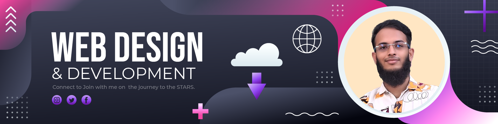

# 👋 Hi, I'm Somrat Sorkar Sourav

## 🚀 Junior Full Stack Web Developer

📍 **Brahmanbaria, Dhaka, Bangladesh**  
📧 **sorkar.s.sourav@gmail.com** | 📱 **+880 1626-979066**  
🔗   

---

### 📖 About Me

Performance-driven Junior Full Stack Developer with a B.Sc. in Mathematics background, emphasizing logical analysis and scalable application design. Hands-on experience building MERN stack applications with a focus on RESTful APIs, MongoDB schema design, and responsive UIs. Currently expanding technical expertise into Next.js, SQL databases (PostgreSQL), and Prisma ORM. Eager to contribute a growth-oriented mindset and clean-coding practices to high-performance development teams.

---

### 🛠️ Technical Skills

#### Frontend

#### Backend

#### Database & ORM

#### Tools & Deployment

---

### 💼 Featured Projects

#### 🌟 [InsightAI](https://github.com/your-repo) - AI-Powered SEO Content Orchestrator

- Architected a full-stack AI content platform using Next.js 16 (App Router) and Gemini 1.5 Flash API
- Integrated The Guardian Open Platform API for live news context
- **Tech Stack:** Next.js 16, MongoDB, Gemini 1.5 Flash, The Guardian API, BetterAuth, Server Actions

#### 📸 [LensLocker](https://lenslocker-link) - Camera Gear Rental Marketplace

- Engineered a full-stack rental marketplace with Next.js 16 and MongoDB
- Implemented RBAC and JWT authentication via NextAuth.js
- Built search/filtering with infinite scroll and rental calculation engine
- **Tech Stack:** Next.js 16, React 19, MongoDB, NextAuth.js, Tailwind CSS, Framer Motion

#### 🏭 [Garment Order & Production Tracker](https://garment-tracker-link) - Supply Chain SaaS

- Designed scalable MongoDB schema for supply chain workflows
- Developed RESTful APIs for order lifecycle management
- Created responsive admin dashboard for production monitoring
- **Tech Stack:** React.js, Node.js, Express.js, MongoDB, Tailwind CSS

---

### 🎓 Education

**B.Sc. in Mathematics**  
National University, Bangladesh | Expected 2028  
_Focus: Algorithmic thinking, data structuring, and logical problem-solving_

---

### 🌐 Languages

- **English:** Professional Working Proficiency
- **Hindi:** Spoken
- **Arabic:** Read and Write
- **Bangla:** Native

---

### 📊 GitHub Stats

---

### 🤝 Connect with Me

  
  
  
  

---

⭐ **Feel free to explore my repositories and let's connect!**
